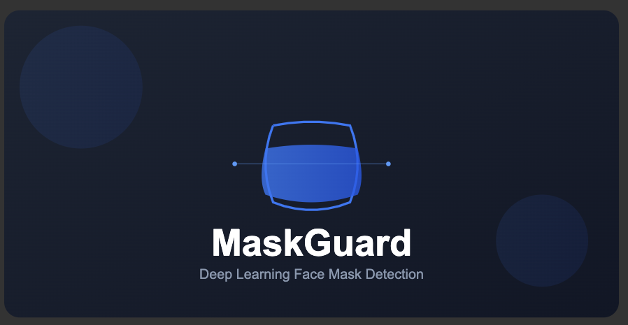

# Face Mask Detection with Deep Learning

A production-ready face mask detection system using ResNet18 neural network and Gradio interface.

<div align="center">

Demo link:   [](https://huggingface.co/spaces/Codemon/maskguard)

</div>



## Project Overview

This project implements a real-time face mask detection system using:
- ResNet18 architecture for efficient inference
- PyTorch for deep learning
- Gradio for interactive UI
- Custom training pipeline optimized for edge deployment

## Installation

```bash
git clone https://github.com/levisstrauss/face-mask-detection
cd face-mask-detection
pip install -r requirements.txt
```

## Dataset

### Training Data
- **Masked Images**: 10,000 samples
- **Unmasked Images**: 10,000 samples
- **Distribution**: Balanced across ethnicity and gender
- **Conditions**: Various lighting, angles, and environments
- **Source**: [Kaggle Face Mask Detection Dataset](https://www.kaggle.com/...)

### Model Architecture

```plaintext
Base: ResNet18 (pretrained on ImageNet)
└── Custom Head
   ├── FC Layer (256 neurons)
   ├── ReLU Activation
   ├── Dropout (p=0.5)
   └── Output Layer (2 classes)
```

### Performance Metrics

| Metric          | Value  |
|-----------------|--------|
| Accuracy        | 98.2%  |
| Inference Time  | 0.12s  |
| Model Size      | 44.7MB |
| F1 Score        | 0.974  |
